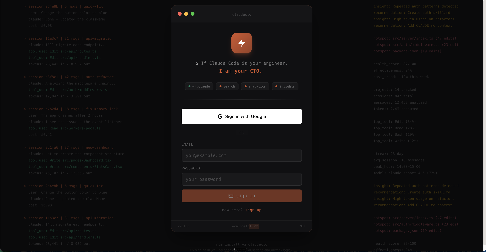
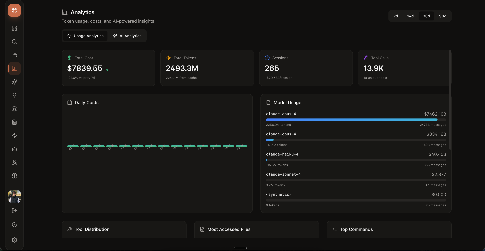
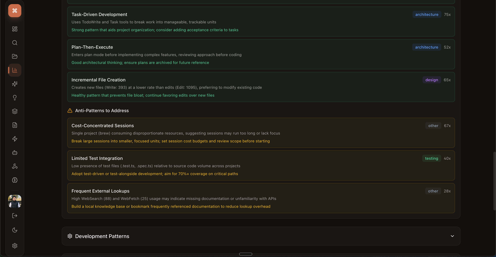
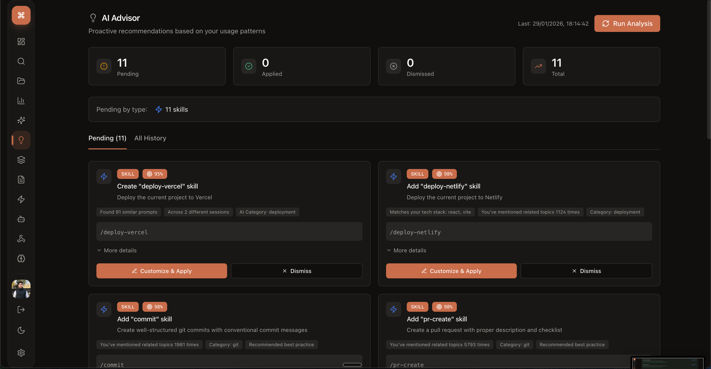
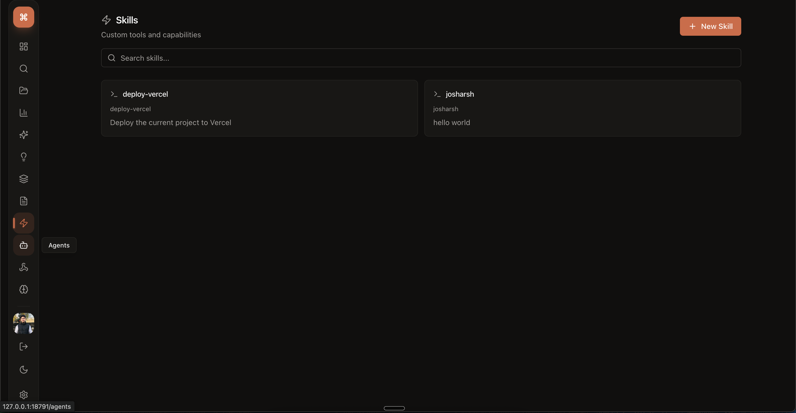
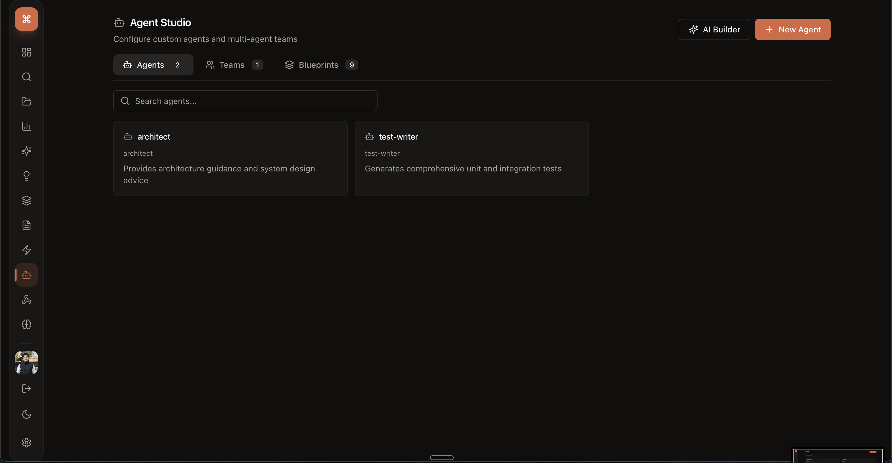

<p align="center">
  
</p>

<h1 align="center">claudecto</h1>

<p align="center">
  <strong>If Claude Code is your engineer, I am your CTO.</strong>
</p>

<p align="center">
  <a href="https://www.npmjs.com/package/claudecto"></a>
  <a href="https://github.com/josharsh/openclaudecto/blob/main/LICENSE"></a>
</p>

---

### Open source is coming.

**claudecto** is a visual dashboard and CLI for [Claude Code](https://docs.anthropic.com/en/docs/claude-code/overview). It reads your `~/.claude` directory and gives you a command center to search, analyze, and optimize everything Claude Code does.

The full source is going open source soon. In the meantime, you can install and use it today:

```bash
npm install -g claudecto
claudecto
```

---

## What's inside

### Analytics & Cost Tracking

Token consumption, cost breakdowns by model, tool usage distribution, and daily activity trends.

<p align="center">
  
</p>

### AI-Powered Insights

Pattern detection, project health scores, code hotspots, recurring challenges, and Claude effectiveness metrics.

<p align="center">
  
</p>

### AI Advisor

Proactive recommendations for skills, hooks, CLAUDE.md additions, and MCP servers based on your actual usage.

<p align="center">
  
</p>

### Skill Studio

Visual skill editor with live preview, validation, and templates.

<p align="center">
  
</p>

### Agent Studio

Configure custom agents and multi-agent teams with leader/teammate roles, blueprints, and AI-powered generation.

<p align="center">
  
</p>

### And more

- **Full-text search** across every Claude conversation
- **Session browser & replay** with syntax-highlighted code
- **Hook builder** with visual editor and test runner
- **Tech stack intelligence** across all projects
- **Memory editor** for CLAUDE.md with project templates
- **50+ REST API endpoints** for custom integrations
- **Integrated terminal** with WebSocket support

---

## Stay in the loop

Star this repo to get notified when the source drops.

---

## Related

- [Claude Code](https://docs.anthropic.com/en/docs/claude-code/overview) — The AI coding assistant this dashboard is built for
- [@anthropic-ai/sdk](https://www.npmjs.com/package/@anthropic-ai/sdk) — Anthropic's official SDK
- [claudecto on npm](https://www.npmjs.com/package/claudecto) — Install and use it today

## License

[MIT](LICENSE)
